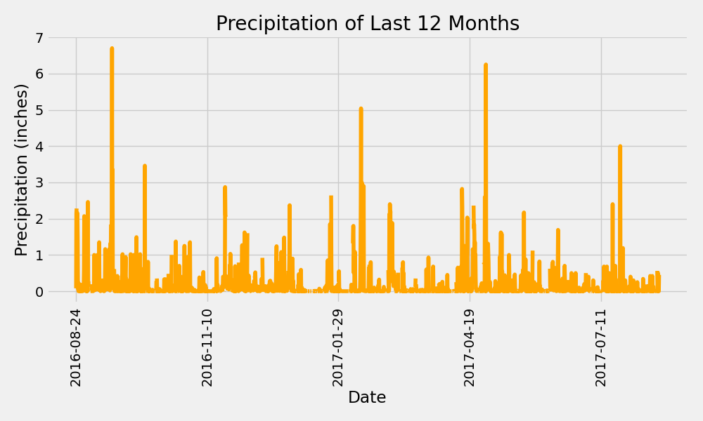
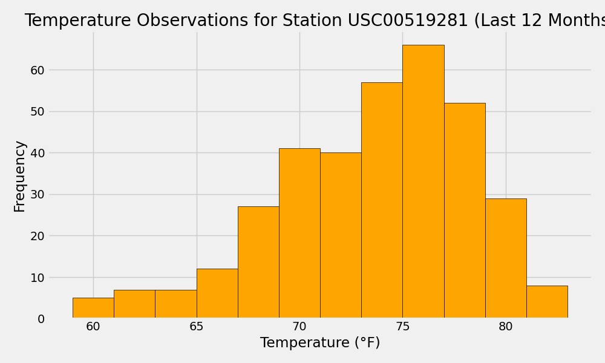

# SQLAlchemy Climate Analysis and Flask API

Welcome to the SQLAlchemy Challenge! This project involves performing climate analysis on the provided data and creating a Flask API to serve the analysis results.

## Project Overview

In this project, climate data from Hawaii is analyzed using SQLAlchemy and Python. We build a Flask API to serve various climate statistics, including precipitation and temperature observations. The data was originally stored in an SQLite database, and SQLAlchemy was used to query the data and extract insights.

## Repository Structure

- `SurfsUp/app.py`: The Flask application that contains all the API endpoints to access the climate analysis data.
- `resources/hawaii.sqlite`: The SQLite database containing the climate data for Hawaii.
- `SurfsUp/Output/`: Directory containing images of analysis outputs.
  - `precipitation_bar.png`: Plot showing the precipitation over the last 12 months.
  - `temperature_histogram.png`: Histogram of temperature observations for the most active station.

## Available Routes

After running the Flask app, the following API routes are available:

1. **Home Route**: `/`
    - Lists all available routes.
2. **Precipitation Data**: `/api/v1.0/precipitation`
    - Returns JSON with the last 12 months of precipitation data, using date as the key and precipitation as the value.
3. **Station Data**: `/api/v1.0/stations`
    - Returns a JSON list of all weather stations.
4. **Temperature Observations**: `/api/v1.0/tobs`
    - Returns a JSON list of temperature observations of the most active station for the last year of data.
5. **Temperature Range Data**: `/api/v1.0/<start>` and `/api/v1.0/<start>/<end>`
    - Returns a JSON list of minimum temperature (`TMIN`), average temperature (`TAVG`), and maximum temperature (`TMAX`) for a specified start or start-end range.

## Example Analysis

### Precipitation Analysis

The following plot shows the precipitation data over the last 12 months in the dataset:



### Temperature Analysis

A histogram of temperature observations for the most active station (`USC00519281`) over the last year is shown below:



## Dependencies

The following dependencies are required to run the project:

- Python 3.9+
- Flask
- SQLAlchemy
- Pandas
- NumPy

Make sure to install these using the command:

```sh
pip install Flask SQLAlchemy pandas numpy
